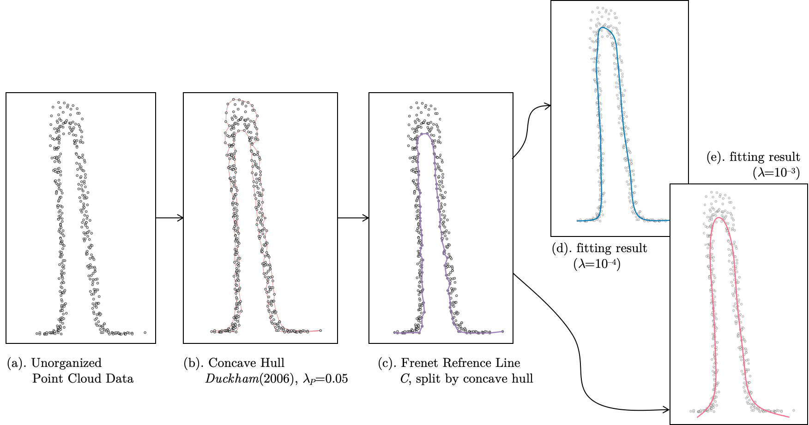

# ALGLIB Spline Fitting Library

This library provide 2 method for spline fitting, which named AlglibSplineFitting and ConcaveHullParamSplineFitting.

1. AlglibSplineFitting support the spline with y=f(x) form and x must be monotonous.(ALGLIB.[Linear/nonlinear least squares](https://www.alglib.net/interpolation/leastsquares.php#splinefit))
<div align="center"></div>

2. ConcaveHullParamSplineFitting support fitting unordered point cloud in any form.  


## File Structure  

```bash
├── CMakeLists.txt
├── README.md
├── alglib                    # ALGLIB src files
├── alglib_spline_fitting.cpp # spline fitting use alglib.spline1dfit
├── alglib_spline_fitting.h   # include file
├── chp_spline_fitting.cpp    # concave hull parameter spline fitting cpp
├── chp_spline_fitting.h      # concave hull parameter spline fitting include file
├── test.cpp                  # a test executable file
├── test.py                   # convert data to geojson
├── concavehull               # concave calculator
│   ├── concavehull.hpp 
│   └── delaunator.hpp 
└── example                   # how to use dll library
│   ├── CMakeLists.txt
│   ├── demo.cpp
│   ├── include
│   └── lib
└── utils                     # geometric tools
    ├── geometry.cpp
    └── geometry.h
```

## How to use 

1. Create Folder and Excute CMAKE Command

```bash
mkdir build
cd build
cmake ..
make & make install
```

2. Copy the `include` and `lib` folder from `install` to `example`

```bash
cp -r install/* example
```

3. Jump into `example` folder and excute command

```bash
cd example
mkdir build
cd build
cmake ..
make
```